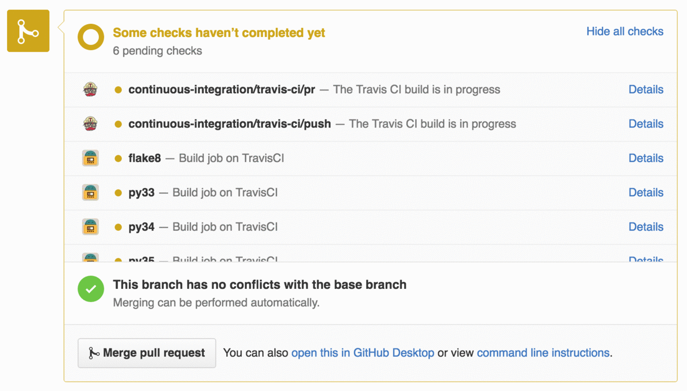

# travieso

[](https://travis-ci.org/wizeline/travieso)


## Contents

1. [About](#about)
2. [Deploy](#deploy)
    - [General instructions](#general-instructions)
    - [Heroku](#heroku)
    - [Kubernetes](#kubernetes)
3. [Contributing](#contributing)


## About

Show TravisCI build jobs on Github.




## Deploy

### General instructions

In your `.travis.yml` file add the following lines:

```
notifications:
  webhooks:
    urls:
      - https://travieso.example.com/
```

Make sure that the TravisCI token you use when configuring the app (`$TRAVIS_TOKEN`) is the TravisCI token for the
user that was used to setup the repository. You can find this token, which you can find in the user's profile
page. [More information](https://docs.travis-ci.com/user/notifications/#Authorization-for-Webhooks).

Make sure the GitHub token that you use has the `repo:status` scope enabled.
[Click here](https://github.com/settings/tokens/new) to generate this token for your GitHub account.

### Heroku

Click the button below to deploy directly to Heroku. You'll need the tokens mentioned before ready and in the
webhook notifications section of your `.travis.yml`, use the url: `https://[the name you set for travieso].herokuapp.com/`.

[](https://heroku.com/deploy)

### Google App Engine

Coming soon...

### Kubernetes

Coming soon...

### Manually

In the server where you want to run the app, run the following:

```
$ git clone https://github.com/wizeline/travieso
$ export GITHUB_TOKEN="Your github token"
$ export TRAVIS_TOKEN="Your travis token"
$ ./bin/web
```

## Contributing

See [CONTRIBUTING.md](#CONTRIBUTING.md)
